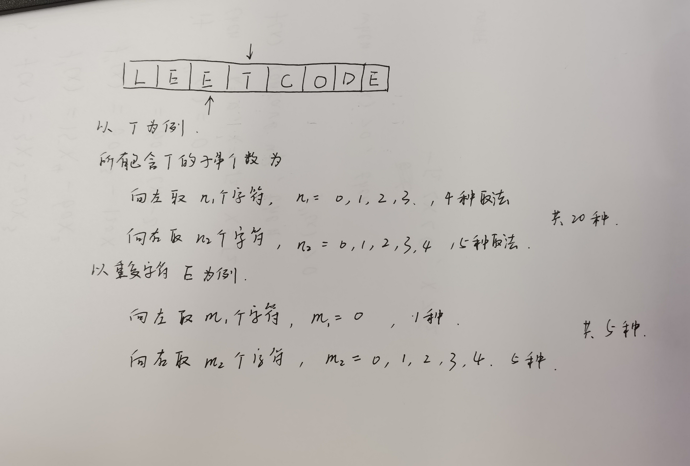

## 统计子串中的唯一字符 828
## 问题描述
我们定义了一个函数 countUniqueChars(s) 来统计字符串 s 中的唯一字符，并返回唯一字符的个数。

例如：s = "LEETCODE" ，则其中 "L", "T","C","O","D" 都是唯一字符，因为它们只出现一次，所以 countUniqueChars(s) = 5 。
本题将会给你一个字符串 s ，我们需要返回 countUniqueChars(t) 的总和，其中 t 是 s 的子字符串。输入用例保证返回值是32 位整数。
注意，某些子字符串可能是重复的，但你统计时也必须算上这些重复的子字符串（也就是说，你必须统计 s 的所有子字符串中的唯一字符）。
## 问题示例1
    输入: s = "ABC"
    输出: 10
    解释: 所有可能的子串为："A","B","C","AB","BC" 和 "ABC"。
        其中，每一个子串都由独特字符构成。
        所以其长度总和为：1 + 1 + 1 + 2 + 2 + 3 = 10
## 问题示例2
    输入: s = "ABA"
    输出: 8
    解释: 除了 countUniqueChars("ABA") = 1 之外，其余与示例 1 相同。
## 问题示例 3：
    输入：s = "LEETCODE"
    输出：92

## 解题思路
根据每个字符在所有字串中是否有效统计
对于字符串中的每个字符，分别找出他们向左和向右遇到第一个相同字符的位置，n1和n2,一旦字串超过这个范围(n1+1,n2-1),该字符在该子串中不被统计。
